# Lumina Language VS Code Extension

## Overview

The Lumina Language VS Code Extension provides language support for the Lumina programming language. This extension offers features such as syntax highlighting, diagnostics, and code completion to enhance the development experience in Visual Studio Code.

## Features

- **Syntax Highlighting:** Provides syntax highlighting for Lumina source files.
- **Diagnostics:** Detects and reports syntax and semantic errors in Lumina code.
- **Code Completion:** Offers suggestions for keywords, variables, functions, and more.
- **Live Templates:** Includes snippets for common code patterns.

## Installation

1. Clone the repository:
   ```bash
   git clone <repository-url>
   ```

2. Navigate to the `extension` directory:
   ```bash
   cd extension
   ```

3. Install dependencies:
   ```bash
   npm install
   ```

## Usage

1. Open the `extension` directory in Visual Studio Code.
2. Press `Ctrl+Shift+B` to start compiling the client and server in watch mode.
3. Switch to the Run and Debug View in the Sidebar (`Ctrl+Shift+D`).
4. Select `Launch Client` from the dropdown.
5. Press `F5` to run the extension in a new Extension Development Host window.

## Development

### Build

To build the extension, run:
```bash
npm run compile
```

### Watch

To start the build process in watch mode, run:
```bash
npm run watch
```

### Lint

To lint the code, run:
```bash
npm run lint
```

## Testing

To run the test suite, execute:
```bash
npm test
```

## Examples

### Hello World

```Lumina
let message: string = "Hello, World!";
console.log(message);
```

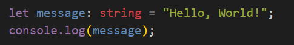

### Fibonacci Sequence

```Lumina
let a: number = 0;
let b: number = 1;
let c: number = 0;

for (let i: number = 0; i < 100; i++) {
    c = a + b;
    a = b;
    b = c;
}

console.log(c);
```

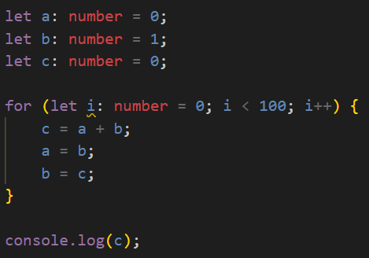

### Function Declaration and Call

```Lumina
function add(a: number, b: number): number {
    return a + b;
}

console.log(add(1, 2));
```

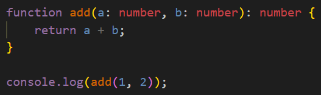

### if else statement

```Lumina
let a: number = 1;

if (a > 0) {
    console.log("a is positive");
} else {
    console.log("a is negative");
}
```

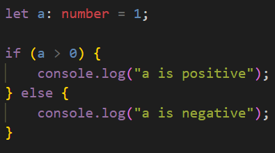


## errors and warnings

### Unused Variable

```Lumina
let a: number = 1;
let b: number = 2;

console.log(a);
```

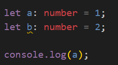
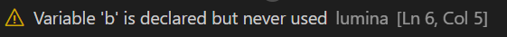

### Type Mismatch

```Lumina
let a: number = 1;
let b: string = "Hello, World!";

console.log(a + b);
```

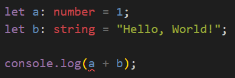
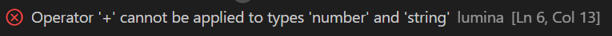

### reassignment of constant variable

```Lumina
const a: number = 1;
a = 2;
```

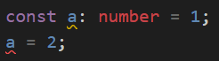
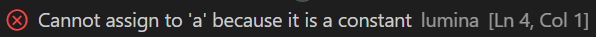


### unknown variable

```Lumina
let a: number = 1;
let b: number = a;

console.log(b);
```

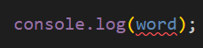
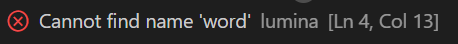

### function declaration error

```Lumina
function func

function func {}
```

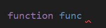

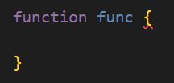

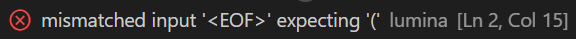


### missing semicolon

```Lumina
let a: number = 1
```

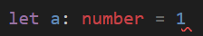
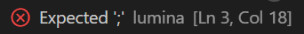


## Completions
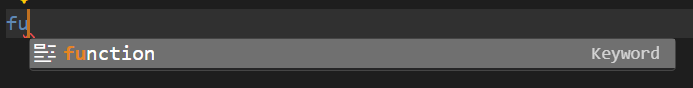
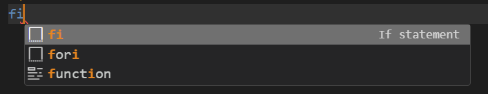

### Live Templates
#### If Statement
type `fi` and press `Tab` to get the following:

```Lumina
if () {
    
}
```

#### If Else Statement
type `elfi` and press `Tab` to get the following:
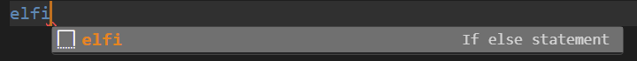
```Lumina
if () {
    
} else {
    
}
```

#### For Loop
type `fori` and press `Tab` to get the following:
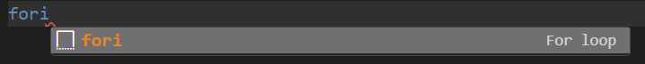
```Lumina
for (let i: number = 0; i < length; i++) {
    
}
```

#### Function Declaration
type `fn` and press `Tab` to get the following:
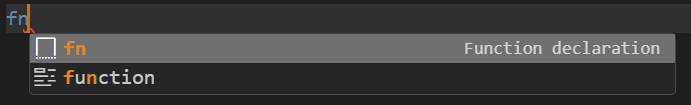
```Lumina
function name(params): type {
    
}
```

#### Console Log
type `log` and press `Tab` to get the following:
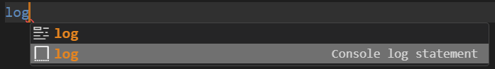
```Lumina
console.log();
```

### Other
When you type the left bracket `(` after a function name, it will automatically add the right bracket `)` and the parameters. `}` or `]` will be added when you type the left bracket `{` or `[`.